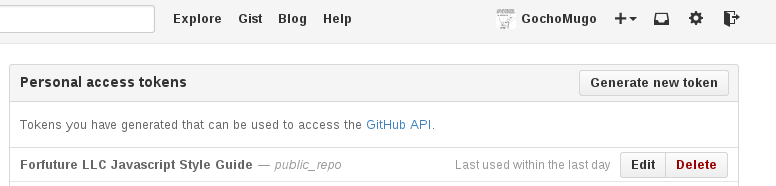

# gh-pages

Automatically Deploy your Repo with Github Pages


## prerequisites:

* Signed up at [Travis CI](travis-ci.org)


## installation:

```bash
⇒ wget -qO-  | bash
```


## setup:

1. Prepare your repo

  ```bash
  ⇒ gh-pages prepare
  ```

1. Generate an access token on Github. **Take note of the token**.

  

1. Add repository in Travis CI.
1. Finish up

  ```bash
  ⇒ gh-pages finish
  ```


## help information:

```
⇒ gh-pages info
```


## license:

**The MIT License (MIT)**

Copyright (c) 2015 GochoMugo <mugo@forfuture.co.ke>

